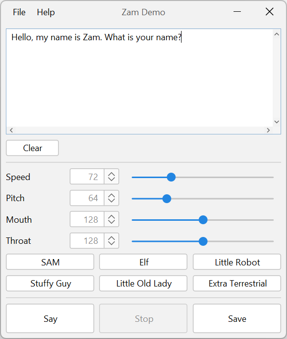

Zam
===

[](https://github.com/the-thing/zam/actions/workflows/ci.yml)
[](https://github.com/the-thing/zam/actions/workflows/codeql.yml)
[](https://app.codecov.io/github/the-thing/zam)

Zam is a text-to-speech (TTS) synthesis engine for Java. It is an actual re-implementation of the reverse-engineered C
version of the classic **Software Automatic Mouth (SAM)**, based on the work
at [s-macke/SAM](https://github.com/s-macke/SAM). It offers retro robotic speech synthesis out of the box in a
modern Java environment.

## Features

* **Text-to-Speech:** Converts plain English text into generated speech audio.
* **Customizable Voice:** Tweak `speed`, `pitch`, `mouth`, `throat`, `sing` parameters to create different sounding
  voices.
* **Swing Demo Application:** A provided UI to play with the synthesis rules and audio parameters.
* **Library Ready:** `zam-speech` can easily be embedded in other Java 17+ projects.

## Project Structure

* **`zam-speech`** - The core Java library. Includes the text reciter, phoneme enricher, phoneme renderer, and audio
  generator.
* **`zam-demo`** - A simple Swing application to demonstrate the capabilities of the synthesizer. The module contains
  additional examples.



## Requirements

* **Java 17** or higher
* **Maven** (for building)

## Usage

Add the `zam-speech` module as a dependency in your project. You can easily generate and play audio using the
`SpeechSynthesizer` class:

```java
public class ZamGenericExample {

    static void main(String[] args) throws LineUnavailableException, IOException {
        // create a default synthesizer instance
        SpeechSynthesizer synthesizer = SpeechSynthesizer.newInstance();

        // simply speak plain English text
        synthesizer.say("Hello. I am a speech synthesizer! I can sound different.");

        // speak with custom themes
        synthesizer.say("Oh no. It is Monday again. I did not sign up for this.", Theme.LITTLE_ROBOT);
        synthesizer.say("I told you to read the documentation. Nobody ever reads the documentation.", Theme.LITTLE_OLD_LADY);
        synthesizer.say("You can do anything. Anything at all. The only limit is yourself.", Theme.EXTRA_TERRESTRIAL);

        // speak with custom parameters
        synthesizer.say("Did someone say cheese? I love cheese!", 60, 200, 200, 50, false);

        // you can also generate phonetic equivalents directly
        synthesizer.sayPhonetic("PIY4TER PAY3PER- PIH4KT AH PEH4K AHV PIH4KULD PEH4PERZ.");

        // the robot sings "la la la"
        synthesizer.say("I can also sing. Look.");
        synthesizer.sayPhonetic("laeaeaeaeaeaeaeaeae laeaeaeaeaeaeaeaeae laeaeaeaeaeaeaeaeae", Theme.SAM, true);

        // generate audio bytes instead of playing
        byte[] audio = synthesizer.generateAudio("This audio could be saved to a file.", Theme.SAM);

        // save audio to waveform
        try (AudioInputStream in = new AudioInputStream(new ByteArrayInputStream(audio), SpeechSynthesizer.AUDIO_FORMAT, audio.length)) {
            AudioSystem.write(in, AudioFileFormat.Type.WAVE, new File("speech.wav"));
        }
    }
}
```

## License

Zam is a Java reimplementation of the reverse-engineered C version
of [Software Automatic Mouth (SAM)](https://en.wikipedia.org/wiki/Software_Automatic_Mouth),
based on the work at [s-macke/SAM](https://github.com/s-macke/SAM).

The original commercial software was published in 1982 by Don't Ask Software (later **SoftVoice, Inc.**,
www.text2speech.com). The company has been unreachable and its website has not been updated since 2009.
The original software is therefore best described as [Abandonware](https://en.wikipedia.org/wiki/Abandonware).

Because the copyright status of the original work remains unresolved, no specific open-source license
can be granted for this project — consistent with the position taken by the upstream C reimplementation.

**Use it at your own risk.**